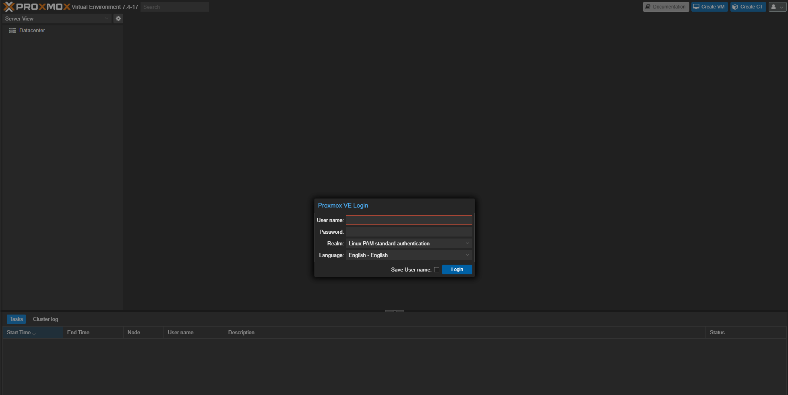
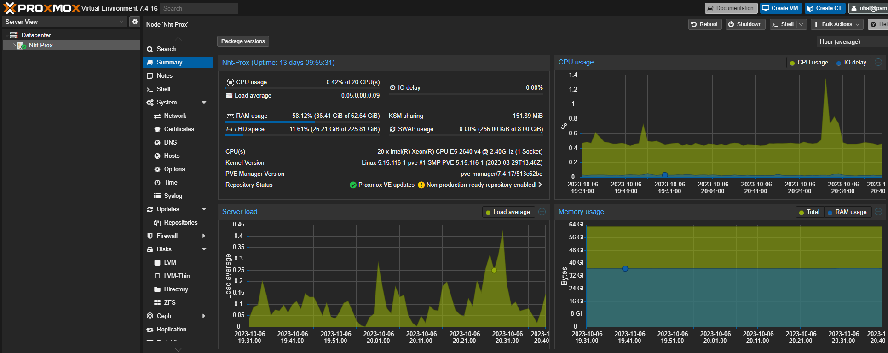
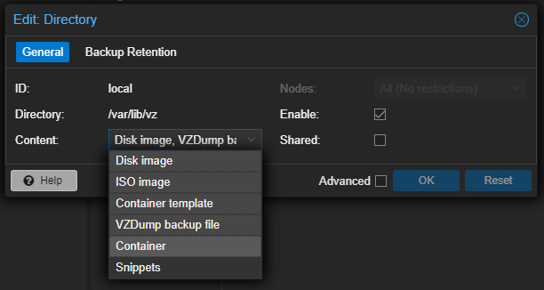

# About the project
This project serves as an opportunity for me to put my virtualization and hypervisor knowledge into practical use. It involves the installation of Proxmox Virtual Environment on a bare-metal server and the subsequent creation of virtual machines on this server.

## Hypervisors
A hypervisor is a type of computer software, firmware, or hardware that creates, run, and manage virtual machines

Type 2 hypervisor, also known as a hosted hypervisor, is a virtualization technology that runs on top of a host operating system and relies on the os for resource management and hardware access. There are several poppular Type 2 hypervisor software options available including Oracle VirtualBox, VMware Fusion, and Parallels Desktop.

Type 1 hypervisor, also known as bare-metal or native hypervisor is virtualization software that runs directly on a physical server's hardware. Some example includes VMware vSphere/ESXi, Microsoft Hyper-V


[Proxmox Virtual Environment](https://www.proxmox.com/en/proxmox-virtual-environment/overview) (Proxmox VE) is rather a comprehensive virtualization platform that combines both Type 1 and Type 2 hypervisor technologies. It is designed to provide virtualization and containerization capabilities in a single integrated solution.

Proxmox VE primarily uses two virtualization technologies:

* __KVM__ (Kernel-based Virtual Machine): Proxmox VE utilizes KVM to offer Type 1 hypervisor functionality. KVM allows you to run virtual machines (VMs) with high performance and security directly on the host hardware.

* __LXC__ (Linux Containers): Proxmox VE also supports LXC, a lightweight containerization technology. LXC containers provide a lightweight and efficient means of isolating applications and services on a shared Linux kernel.

Additionally, Proxmox VE includes a web-based management interface that simplifies the management and deployment of virtual machines and containers. It offers features like live migration, backup and restore, storage management, and more.

This project focuses on my installation of Proxmox VE on [the bare-metal server](https://github.com/nhatcompsci/Homelab-Documentation/tree/main/1-hardware-assembly) I recently constructed.

## Installation

Before I started with the installation, I made sure the server was all set up by plugging in the power cord and connecting an Ethernet cable. I also had a monitor and keyboard ready for the initial setup.

I got the Proxmox VE ISO Installer from their official website [here](https://www.proxmox.com/en/downloads)

Then, I used [Rufus](https://rufus.ie/en/) to turn a regular USB flash drive into a bootable one with the Proxmox VE ISO. I popped that flash drive into the server and started it up. The server should boot from the USB flash drive, the Proxmox VE Installer should be there.

Here are the steps in the Proxmox VE Installer:
* Select the disk to install the Proxmox VE on
* Set the location information
* Create a password for the server
* Set local IP address, Gateway, and DNS Server
* Review all the details and wait for the installation to finish.

Once it's done installing, the server will reboot on its own. That's the time to take out the flash drive. After that, I can access the Proxmox VE server through the web UI using the IP address I configured earlier.

## Screenshots





## Before creating my first Virtual Machine (VM)
There were a few steps I needed to take. 

* First, I had to increase the available storage because initially, some of the storage was reserved for local-LVM, which couldn't be used for virtual machines. To resolve this, I deleted this volume by following these steps:
    * Navigate to Datacenter -> Storage -> local-lvm -> Remove
    
        After removing the unnecessary volume, I proceeded to free up storage space using a few commands in the Proxmox server shell:

    * Access the shell by going to Datacenter -> Proxmox-server -> Shell and execute the following commands:
    
        ```sh
        lvremove /dev/pve/data

        lvresize -l +100%FREE /dev/pve/root

        resize2fs /dev/mapper/pve-root
        ```

    Now, I have the entire "local" volume available for use with my Virtual Machines.

* Second, I needed to allocate the "local" disk and my other disk named "oneTB" for use as storage for both disk images and containers for my Virtual Machines.
    * Navigate to Datacenter -> Storage -> local -> Edit, and make sure that the options for "Disk image" and "Container" were enable
    
    * Repeat the same process for the "oneTB" disk.

After completing these steps, I was all set and ready to create virtual machines.
